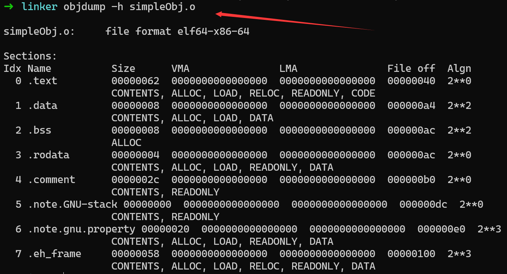
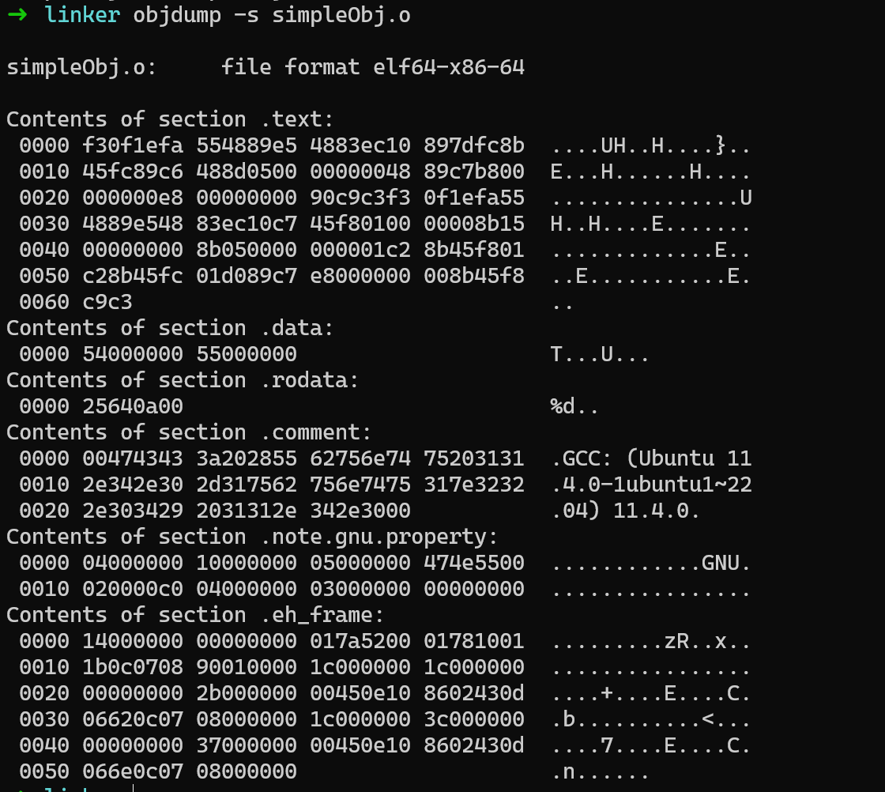

---
authors:
    - taoger
categories:
    - book
    - linker
date: 2024-02-29
nostatistics: true
---

!!! abstract
    程序员的自我修养

<!-- more -->

## 目标文件的格式

使用` objdump -h simpleObj.o`

objdump 的 `-s` 参数可以将所有段的内容以十六进制的方式打印出来， `-d` 参数可以将所有包含指令的段反汇编

