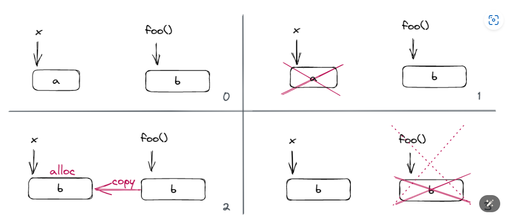

---
authors:
    - taoger
categories:
    - modern cpp
    - os
date: 2024-02-29
nostatistics: true

---

# C++ 核心概念

!!! abstract
    jyy os

<!-- more -->

# 右值引用：Rvalue References

## Rvalue 和 Lvalue
为什么需要右值引用，其引入解决了两个问题：
- 移动语义：
- 完美转发：

首先需要区别什么是 `lvalues` 以及 `rvalues`，这两个概念最开始是从C中引入的，但是C++有些不同，但是需要注意：

1. `lvalue & rvalue`是`expression`的属性，即`value category`，表达式是运算符和操作数的序列，用来指明计算，计算的结果是产生值，也可以导致副作用，比如：
`std::cout << 1`

2. primary expression：
    - this
    - 字面量，例如 2 或者 "Hello, world!"
    - id-expressions，例如 n 或者 std::cout
    - lambda 表达式，例如 [](int & n) { n *= 2; }

3. 为什么`int m; m + 1 = 2；int foo(); foo() = 2`这些表达式是违法的，其实每个表达式其实都有两个性质，一个是我们熟知的 类型 `(type)`，而另一个就是我们刚刚发现的「新区别」：`value category`。


### lvalue
An lvalue is an `expression` that refers to a `memory location` and allows us to take the address of that memory location via the `&` operator.
- `任何有名字`的表达式都是左值，比如`int n = 1`，唯一的例外是枚举

- 内置 的 `++a`, `a = b`, `a += b`, *p, p->m 是 lvalue，因为`a = b`返回的是a的引用，*p和p->m体现占内存的操作。

- 返回值为引用类型的函数调用表达式是 lvalue，因为返回值表征的是一个对象，比如`int& foo()`

- 如果 a 是 `lvalue`，m 是成员变量，则 `a.m` 是 `lvalue`；如果 m 是成员变量，`p->m` 是 lvalue。

- 除了字符串字面量是 lvalue（因为字符串字面量的类型是 `const char[N]lex.string#5` 以外，其他字面量都是 rvalue

```cpp
// lvalue
int i = 42;
i = 43; // ok, i is an lvalue
int* p = &i; // ok, i is an lvalue
int& foo();
foo() = 42; // ok, foo() is an lvalue
int* p1 = &foo(); // ok, foo() is an lvalue
```
### rvalue：

右值不表征对象，非左值表达式就是右值表达式，右值常用来完成以下两件事：

1. 计算内置操作符(非重载运算符)的一个操作数，比如`1 + 2 + 3`，即`1 + 2`是rvalue，作为第二个`+`的操作数。

2. 初始化对象
    - 初始化出来的这个对象称为这个表达式的`result object`
    - `int i = 1 + 1; void f(int x); f(1)`，用来初始化i和参数x

右值包括：
- 枚举数 (enumerator) 和除了字符串字面量以外的字面量是 `rvalue`，比如`int i = 100`，100是右值

- `a++`，因为a++返回的是原来的a，`a + b`, `a || b`, `a < b`, `&a` 等表达式是 rvalue

- 目标为非引用类型的 cast expression 是 rvalue，如 int(3.0)

- this 是 rvalue，因为this不能赋值

- lambda 表达式是 rvalue

```cpp
int foobar();
int j = 0;
j = foobar(); // ok, foobar() is an rvalue
int* p2 = &foobar(); // error, cannot take the address of an rvalue
j = 42; // ok, 42 is an rvalue
```

## Move Semantics

假设类X拥有某些资源的`pointer或者handler`，所以当类X发生拷贝的时候，需要自定义拷贝构造函数。
```cpp
X& X::operator=(X const & rhs)
{
  // [...]
  // Make a clone of what rhs.m_pResource refers to.
  // Destruct the resource that this.m_pResource refers to. 
  // Attach the clone to this.m_pResource.
  // [...]
}
```

拷贝赋值可能发生的情况
```cpp
X foo();
X x;
// perhaps use x in various ways
x = foo();
```
对于`x = foo()`这一语句，发生以下事情：

- clones the resource from the `temporary` returned by foo
- `destructs` the resource held by x and replaces it with the clone
- `destructs` the `temporary` and thereby releases its resource

用图表示为:



很明显，对于这种声明周期快要结束的`temporary object`而言重复这种拷贝和析构是低效的，能否提供一种机制让`x`直接`交换`temporary object的资源，然后让`temporary object`在析构的时候将x原来的资源释放掉。

即我们需要一个特殊的`copy assignment operator`，在等式右边是右值的时候，做到：

```cpp
// [...]
// swap m_pResource and rhs.m_pResource
// [...]  
```
这个想法就是C++11提出的`move semantics`，考虑如何实现函数重载，对于`overload of the copy assignment operator`，这个`mystery type`需要有以下特点：

- 必须是reference
- 如果传入rvalue则选择`mystery type`，lvalue则选择`ordinary reference`

```cpp
X& X::operator=(<mystery type> rhs)
{
  // [...]
  // swap this->m_pResource and rhs.m_pResource
  // [...]  
}
```
这种特殊的`reference`即`Rvalue Reference`，效果如下：

```cpp
void foo(X& x); // lvalue reference overload
void foo(X&& x); // rvalue reference overload

X x;
X foobar();

foo(x); // argument is lvalue: calls foo(X&)
foo(foobar()); // argument is rvalue: calls foo(X&&)
```
有了右值引用后，可以重载任何函数，

```cpp
X& X::operator=(X const & rhs); // classical implementation
X& X::operator=(X&& rhs)
{
  // Move semantics: exchange content between this and rhs
  return *this;
}
```

#### Forcing Move Semantics（std::move）

C++设计右值引用最开始是为了实现`move semantics`以提高性能，但是如果程序员同样需要在`lvalue`上实现`move semantics`，C++也提供了对应的机制，比如下面这个模板函数：

```cpp
template<class T>
void swap(T& a, T& b)
{
    T tmp(a);
    a = b;
    b = tmp;
}

X a , b;
swap(a, b)
```

这里并没有右值，但是这里的`swap`如果使用移动语义，性能更好，省区拷贝析构的代价，所以C++11提供了一个`std::move()`，它将其参数转换为右值，而不执行任何其他操作，即程序员如果意思到当前的对象可能发生资源转换，可以通过`std::move`将其转换为右值，使用过`std::move`后的object里面资源状态是未确定的，Moved-from objects exist in an unspecified, but `valid`, state，即做下面事情是合法的

- destruction
- assignment
- const observers such as get, empty, size  

使用`std::move`后的`swap`函数如下：

```cpp
// T类需要实现移动构造和移动赋值
template<class T>
void swap(T& a, T& b)
{
   T c = std::move(a);
   a = std::move(b);
   b = std::move(c);
}
```

注意如果我们写下`a = std::move(b)`，我们希望`a`和`b`的资源发生交换，但是如果仅仅是发生交换，被交换后a拥有的资源何时被析构暂时没做定义，所以需要在交换后要保证`b`处于可以被析构以及赋值的状态。

```cpp
X& X::operator=(X&& rhs)
{

  // Perform a cleanup that takes care of at least those parts of the
  // destructor that have side effects. Be sure to leave the object
  // in a destructible and assignable state.

  // Move semantics: exchange content between this and rhs
  
  return *this;
}

```

#### Is an Rvalue Reference an Rvalue
考虑下面这个函数，假设`X`已经实现移动语义。
一般如果考虑传入的是右值引用，那么下面的代码应该调用`X(X&& rhs)`，但是正确的判断的准则为:

if it has a name, then it is an lvalue. Otherwise, it is an rvalue.

移动语义学的全部意义在于只在“无关紧要”的地方应用它，即我们移动的对象在移动之后立即死亡和消失。因此有了这样的规则，比如:

- 对于`x = foo()`是在「不影响结果的地方」使用，因为这样一定不会带来问题

- 对于`std::move`，则是「程序员明确知道这里使用移动不影响结果」，程序员对这样的移动语义负责

但是对于` X anotherX = x;`，由于后续的操作可能使用x，并且仍在作用域中，所以窃取是危险的行为。
```cpp
void foo(X&& x)
{
  X anotherX = x; // 这里实际上调用 copy constructor
  // ...
}
```

应用` if-it-has-a-name rule`可以有以下判断，`goo()`的返回值没有名字，但是我们通过右值引用延长了其声明周期，所以为`xvalue`。
```cpp
void foo(X&& x)
{
  X anotherX = x; // calls X(X const & rhs)
}

X&& goo(); // goo的返回值没有名字，但是我们通过右值引用延长了其声明周期
X x = goo(); // calls X(X&& rhs) because the thing on
             // the right hand side has no name
```

上面的这一点要在继承类的构造函数中特别注意，比如`Base`类实现了移动语义，`Derived`继承了`Base`，对于`Derived`的构造函数：

```cpp
// wrong
Derived(Derived&& rhs) 
  : Base(rhs) // wrong: rhs is an lvalue
{
  // Derived-specific stuff
}

// ok
Derived(Derived&& rhs) 
  : Base(std::move(rhs)) // good, calls Base(Base&& rhs)
{
  // Derived-specific stuff
}
```
#### Move Semantics and Compiler Optimizations
考虑下面的代码片段：如果禁用`Return Value Optimization`，可能会天真的以为这个函数会调用`copy constructor`来用`x`初始化返回值临时对象，然后局部变量x会被析构，既然已知x的生命周期，能够采用`move-constructor`来构造返回值临时对象
```cpp
X foo()
{
  X x;
  // perhaps do something to x
  return x;
}
```
即把代码修改为：
```cpp
X foo()
{
  X x;
  // perhaps do something to x
  return x;
}
```
但是，相比在`constructing an X locally`然后`copying it out`, 现代编译器通常采用会`construct the X object directly at the location of foo's return value`，即称为`return value optimization`，这优于`move semantics`

#### Perfect Forwarding

设计`move semantics`的目的之一是为了解决`perfect forwarding problem`，那到底什么是完美转发：

- 完美转发：接收任意数量实参的`函数模板`，它可以将实参转发到`其他`的函数，使目标函数接收到的实参与被传递给转发函数的实参`保持一致`

比如考虑下面的函数模板:想让`factory function`的arg转发到 `T's constructor`.
```cpp
template<typename T, typename Arg>
std::shared_ptr<T> factory(Arg arg)
{
    return std::shared_ptr<T>(new T(arg));
}
```
但是按照模板的推导规则，上面的代码会导致`call by value`，这导致采用引用为参数的构造函数失败，是否对`ParamType`变为引用即解决问题呢，即

```cpp
template<typename T, typename Arg>
std::shared_ptr<T> factory(Arg& arg)
{
    return std::shared_ptr<T>(new T(arg));
}
```
按照模板的推导规则，这个函数无法传入右值：

```cpp
factory<X>(41) // error
factory<X>(hoo()); // error if hoo returns by value
```

这个错误可以通过修改为const解决：但是如果`factory`函数参数的个数变多，这个方法变得不可扩展，你需要提供各种`const&non-const`变体，而且这种方法这种方法没法实现移动语义，因为这里全是左值，但是右值引用可以解决这个问题。
```cpp
template<typename T, typename Arg>
std::shared_ptr<T> factory(Arg const & arg)
{
    return std::shared_ptr<T>(new T(arg));
}
```
这里涉及`reference collapsing`的规则：这个规则还可以应用在模板的`ParamType`的推导上，
- `T& &` becomes `T&`
- `T& &&` becomes `T&`
- `T&& &` becomes `T&`
- `T&& &&` becomes `T&&`

对于`ParamType`是一个通用引用的情景，规则是：

- 如果`expr`是右值，忽略引用，比如对于右值`A`，`T`被推导为`A`，`ParamType`类型即为`A&&`
- 如果`expr`是左值，`T`和`ParamType`都会被推导为左值引用，比如对于左值`A`，T被推导为`T&`，然后T& && -> T&，`ParamType`类型也为`A&`

```cpp
template<typename T>
void foo(T&&);
```

考虑上面的规则，之前的函数形式修改为：
```cpp
template<typename T, typename Arg>
std::shared_ptr<T> factory(Arg&& arg)
{
    return std::shared_ptr<T>(new T(std::forward<Arg>(arg)));
}
```
注意由于`arg`是万能引用，对通用引用使用`std::forward`。

这里的`std::forward`的形式如下：
```cpp

```