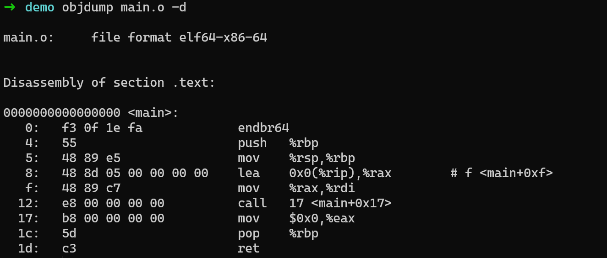
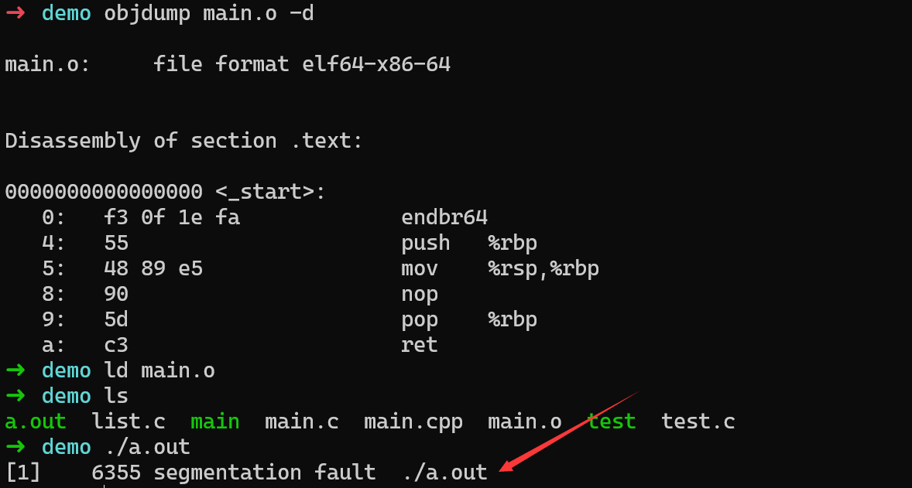
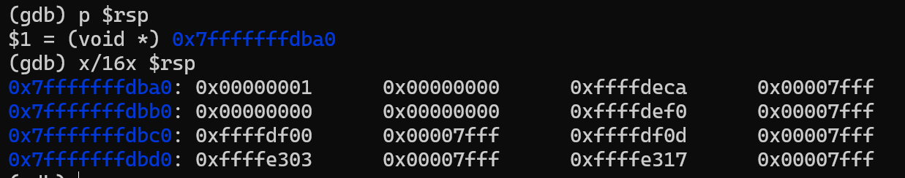
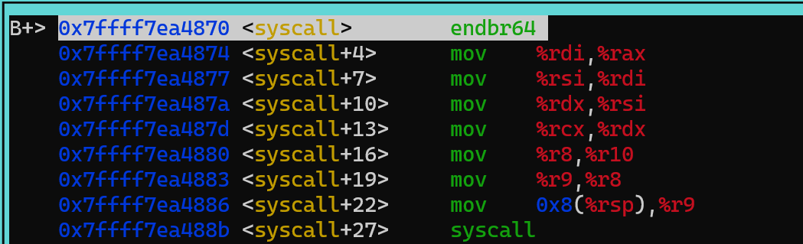

---
authors:
    - taoger
categories:
    - nju
    - os
date: 2024-02-29
nostatistics: true
---

# 南京大学操作系统
!!! abstract
    jyy os

<!-- more -->

!!! info 南京大学操作系统

    [jyyos](https://jyywiki.cn/OS/2023/)

## Lec0 操作系统上的程序

- 如何构建最小的`hello world`：如果采用`-static` 会复制 libc，那么如果采用`gcc -c`和`ld`链接会失败，下面是`gcc -c`产生的`elf`文件的汇编代码

```c
#include <stdio.h>

int main()
{
	printf("hello,world\n");
}
```

## {width = "300"}

直接采用`ld`链接，会发现os上的程序需要libc中的==_start()函数==调用main函数，所以尝试直接将函数声明为`_start()`并且去除`printf`对`puts`的调用，因为没有库函数定义`puts`

```c
void _start() {

}
```

```shell
ld: warning: cannot find entry symbol _start; defaulting to 0000000000401000
ld: main.o: in function `main':
main.c:(.text+0x13): undefined reference to `puts'
```

然后发生了` segmentation fault`，但是将`_start()`的函数体改为`while(1)`就能消除bug

{width = "300"}

??? warning "原因"

​	使用`GDB`查看哪条指令导致了段错误：发现是`ret`指令导致，ret指令的语义是就是将栈顶存储的`ra`赋值给`pc`，然后出栈，即`stack[rsp] -> rip; rsp = rsp + 8`；出错的原因可能是`rsp`指向的堆栈区不合法，查看后排除，但是发现`rip`的值会被赋值为1，地址为`0x1`的内存不能被访问，导致段错误，所以解决方法就是死循环不返回。




!!! info  "发现"
    纯粹的计算指令无法让状态机顺利结束，需要调用`syscall`让系统停下来；由下面的代码发现，`syscall`在执行前需要根据手册对对应的寄存器赋值，即准备好需要的系统调用参数，把控制权交给操作系统，但是`syscall`的实现在`libc`中，不方便直接链接。所以最小的`hello world`就是模仿`syscall`，自己实现`libc`。

```c
#include <sys/syscall.h>

int main() {
  syscall(SYS_exit, 42);
}
```



最小的hello，world实现如下:

??? warning "坑点"
    注意这个文件为`hello.S`，后缀为大写的S，然后使用`gcc -c hello.S && ld hello.o`生成可执行文件

```assembly
#include <sys/syscall.h>

.globl _start
_start:
movq $SYS_write, %rax // write(
    movq $1,         %rdi //    fd = 1
    movq $st,        %rsi //    buf = st
    movq $(ed-st),   %rdx //    count=ed-st
    syscall               //    );

    movq $SYS_exit,  %rax // exit(
    movq $1,         %rdi //    status = 1
    syscall               //    );

st:
    .ascii "\033[01;31mHello, OS World\033[0m\n"
ed:
```

