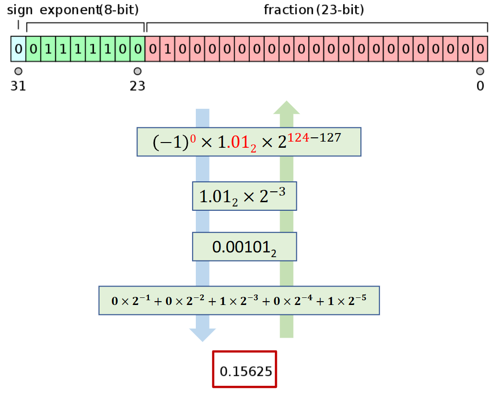
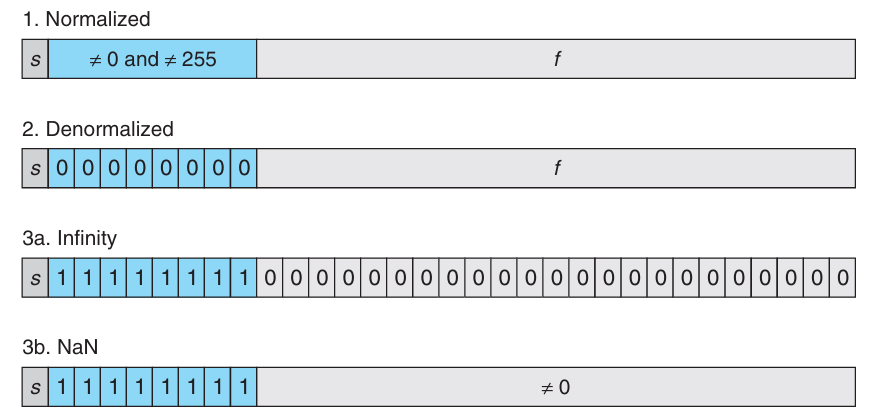
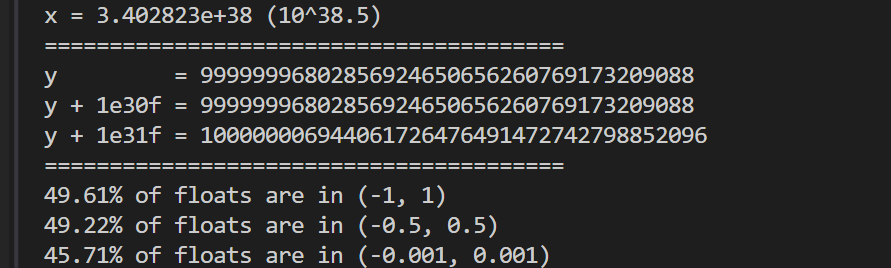
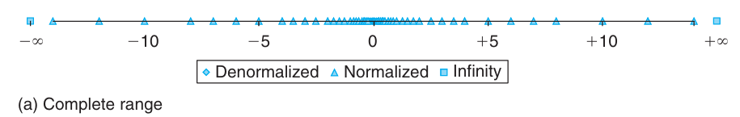

---
authors:
    - taoger
categories:
    - ics
    - csapp
date: 2023-12-01
nostatistics: true
---

## Ch2

### 整数运算

- 补码表示：当`x`是`Tmin`的时候，$x$

### 浮点数: IEEE 754

-  IEEE 754 浮点表示




- 浮点数分类



- 浮点数表示密度

浮点数的表示大部分都集中在0的附近，可以通过下面的代码发现，出现在`[-1,1]`区间的`95%`都出现在区间`[-0.5,0.5]`之间，说明754表示较小的数时较为精确，越大的数字，距离下一个实数的距离就越大

```c
#include <math.h>
#include <stdio.h>
#include <stdint.h>
#include <float.h>
int main()
{
    float x = FLT_MAX;
    printf("x = %e (10^%.1f)\n", x, log10(x));
    printf("========================================\n");
    
    float y = 1e38;
    printf("y         = %.0f\n", y);
    printf("y + 1e30f = %.0f\n", y + 1e30f);
    printf("y + 1e31f = %.0f\n", y + 1e31f);

    printf("========================================\n");

    unsigned long n1 = 0, n2 = 0, n3 = 0;
    union demo
    {    
        float f;
        int i;
    } z;
    for(uint32_t i = 0; ; i++) {
        z.i = i;
        if(-1.0 < z.f && z.f < 1.0) n1++;
        if(-0.5f < z.f && z.f < 0.5f) n2++;
        if(-0.001 < z.f && z.f < 0.001) n3++;
        if(i == UINT32_MAX) break;
    }

    double n = (double)UINT32_MAX + 1;
    printf("%.2lf%% of floats are in (-1, 1)\n", (double)n1 / n * 100);
    printf("%.2lf%% of floats are in (-0.5, 0.5)\n", (double)n2 / n * 100);
    printf("%.2lf%% of floats are in (-0.001, 0.001)\n", (double)n3 / n * 100);
    
    return 0;
}
```

<figure markdown>
  { width="300" }
  <figcaption>Image caption</figcaption>
</figure>





